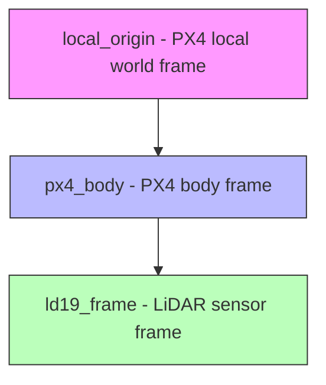

# LaserScan to PointCloud3D Assembler with PX4 Integration

This ROS2 package creates rich 3D point clouds from 2D laser scans using **spherical linear interpolation** and **PX4 direct motion compensation**. It accumulates multiple laser scans while the drone moves, creating a 3D effect from 2D LiDAR data.

## Core Algorithm: Spherical Linear Interpolation

The main innovation is **motion-compensated spherical interpolation** that handles fast drone movement:

1. **Time-Based Transform Queries**: Samples robot poses at multiple points during each laser scan
2. **Spherical Interpolation**: Uses `slerp()` for smooth rotation interpolation between poses  
3. **Per-Ray Compensation**: Each laser ray gets unique motion compensation based on its timestamp
4. **PX4 Direct Integration**: Uses PX4's high-frequency odometry for motion estimation

## Key Topics

### Input Topics
```
/ld19_sim/scan (sensor_msgs/LaserScan) - 2D laser scan data (~1.4 Hz)
/px4_0/fmu/out/vehicle_odometry (px4_msgs/VehicleOdometry) - PX4 motion data (~12 Hz)  
/px4_0/fmu/out/vehicle_attitude (px4_msgs/VehicleAttitude) - PX4 attitude data (~12 Hz)
```

### Output Topics  
```
/ambient_pointcloud (sensor_msgs/PointCloud2) - Assembled 3D point cloud
```

## Frame Configuration



**Frame Details:**
- `local_origin`: PX4's local world frame (where drone was armed)
- `px4_body`: PX4's body-fixed frame (drone center, NED convention)
- `ld19_frame`: LiDAR sensor frame (static offset from body)

## Critical Quality Parameters

### Spherical Interpolation (Most Important)
```yaml
number_of_tf_queries_for_spherical_interpolation: 4  # Increase to 8-16 for fast rotation
tf_lookup_timeout: 0.15  # Time to wait for transforms
```

### Motion Compensation  
```yaml
use_px4_motion_compensation: true  # Enable direct PX4 integration
max_linear_velocity: 2.0   # m/s - adjust to your drone's max speed
max_angular_velocity: 1.0  # rad/s - increase for fast spinning (2.0-3.0)
px4_odometry_topic: "/px4_0/fmu/out/vehicle_odometry"
px4_attitude_topic: "/px4_0/fmu/out/vehicle_attitude"
```

### Assembly Control
```yaml
number_of_scans_to_assemble_per_cloud: 20  # Base number of scans
min_number_of_scans_to_assemble_per_cloud: 5   # Minimum when moving fast
max_number_of_scans_to_assemble_per_cloud: 50  # Maximum when hovering
timeout_for_cloud_assembly: 1.0  # Seconds to wait for scans
```

## Algorithm Flow

### 1. Scan Reception & Motion Analysis
```cpp
void processLaserScan(const sensor_msgs::msg::LaserScan::SharedPtr& laser_scan) {
    // Check if need new cloud (count or timeout)
    if (scans >= target_scans || timeout_reached) {
        initNewPointCloud();  // Start fresh cloud
    }
    
    // Call core algorithm
    integrateLaserScanWithShpericalLinearInterpolation(laser_scan);
}
```

### 2. Core Spherical Interpolation Algorithm
```cpp
bool integrateLaserScanWithShpericalLinearInterpolation(LaserScan& scan) {
    // 1. Setup time domain
    scan_duration = scan.ranges.size() * scan.time_increment;
    time_slice = scan_duration / (num_tf_queries - 1);
    
    // 2. Query transforms at multiple time points  
    for (int i = 0; i < num_tf_queries; i++) {
        query_time = scan_start + i * time_slice;
        lookupTransform(past_tf, future_tf, query_time);
    }
    
    // 3. Process each laser ray with interpolation
    for (each_point in scan.ranges) {
        // Project 2D polar to 3D cartesian
        point_3d = polar_to_cartesian(range, angle);
        
        // Calculate interpolation ratio for this point's timestamp
        ratio = (point_time - past_tf_time) / time_slice;
        
        // Interpolate transform (KEY ALGORITHM)
        interpolated_translation = lerp(past_pos, future_pos, ratio);
        interpolated_rotation = slerp(past_quat, future_quat, ratio);  // Spherical!
        
        // Apply motion compensation
        compensated_point = interpolated_transform * point_3d;
        
        // Add to point cloud
        addToCloud(compensated_point, intensity);
    }
}
```

### 3. PX4 Motion Compensation
```cpp
void adjustAssemblyConfigurationFromPX4Odometry(VehicleOdometry& px4_odom) {
    // Extract velocity from PX4 NED frame
    linear_vel = sqrt(px4_odom.velocity[0]² + px4_odom.velocity[1]² + px4_odom.velocity[2]²);
    angular_vel = sqrt(px4_odom.angular_velocity[0]² + px4_odom.angular_velocity[1]² + px4_odom.angular_velocity[2]²);
    
    // Dynamically adjust scan collection (AUTOMATIC TUNING)
    inverse_linear_vel = max_linear_vel - min(linear_vel, max_linear_vel);
    inverse_angular_vel = max_angular_vel - min(angular_vel, max_angular_vel);
    
    // More scans when slow, fewer when fast
    target_scans = min_scans + (max_scans - min_scans) * min(inverse_linear_vel, inverse_angular_vel);
    target_timeout = min_timeout + (max_timeout - min_timeout) * min(inverse_linear_vel, inverse_angular_vel);
}
```

## Fixing Fast Rotation Issues

### Problem: Scan "Shifting" During Fast Spins
When spinning fast (~1-3 rad/s), your 1.4 Hz laser scans get "smeared" because:
- Each scan takes ~0.7 seconds to complete
- Drone rotates significantly during this time  
- Default 4 TF queries aren't enough for smooth interpolation

### Solution: Increase Interpolation Resolution
```yaml
# In launch file or parameters
number_of_tf_queries_for_spherical_interpolation: 16  # More transform samples
max_angular_velocity: 3.0  # Match your actual spin rate
min_number_of_scans_to_assemble_per_cloud: 3  # Fewer scans when spinning fast
timeout_for_cloud_assembly: 0.5  # Don't wait too long during fast motion
```

### Why This Works:
- **16 TF queries** = 16 pose samples across 0.7s scan duration  
- **Spherical interpolation** smoothly blends between these poses
- **Each laser ray** gets precise motion compensation based on its timestamp
- **Automatic adjustment** reduces scan count when spinning fast

## Usage

### Launch Commands
```bash
# Simulation
ros2 launch laserscan_to_pointcloud cloud_px4_real.launch.py

# Check topic frequencies (IMPORTANT)
source /opt/ros/humble/setup.bash && source install/setup.bash
ros2 topic hz /ld19_sim/scan          # Should be ~1.4 Hz  
ros2 topic hz /px4_0/fmu/out/vehicle_odometry  # Should be ~12 Hz
```

### Key Launch Parameters
```python
# Core algorithm parameters
'number_of_scans_to_assemble_per_cloud': 20,
'number_of_tf_queries_for_spherical_interpolation': 4,  # Increase for fast motion!
'timeout_for_cloud_assembly': 5.0,

# Frame setup - MUST MATCH YOUR TF TREE
'target_frame': 'local_origin',    # PX4 world frame
'laser_frame': 'ld19_frame',       # LiDAR sensor frame

# PX4 direct integration (NO TF motion estimation needed)
'use_px4_motion_compensation': True,
'motion_estimation_source_frame_id': '',  # Empty - using direct PX4
'motion_estimation_target_frame_id': '',  # Empty - using direct PX4

# Motion limits - ADJUST TO YOUR DRONE
'max_linear_velocity': 10.0,   # m/s
'max_angular_velocity': 2.0,   # rad/s
```

## Performance Notes

### Topic Frequency Impact
- **Laser @ 1.4 Hz**: Slow, but sufficient for 3D effect
- **PX4 @ 12 Hz**: Good for motion compensation  
- **Algorithm**: Compensates for slow laser with high-freq motion data

### CPU Usage
- Scales with `number_of_tf_queries_for_spherical_interpolation`
- 4 queries = minimal CPU, 16 queries = higher CPU but better quality
- Trade-off between motion compensation quality and performance

### Memory Usage  
- Proportional to `max_number_of_scans_to_assemble_per_cloud`
- Each scan adds ~400-800 points to cloud
- Clouds published immediately after assembly (no accumulation)

## Dependencies

```xml
<depend>rclcpp</depend>
<depend>sensor_msgs</depend>
<depend>px4_msgs</depend>    <!-- PX4 message types -->
<depend>tf2_ros</depend>
<depend>tf2_geometry_msgs</depend>
<depend>geometry_msgs</depend>
<depend>nav_msgs</depend>
```

## Troubleshooting

### Common Issues

1. **"Shifting" during fast rotation**:
   - Increase `number_of_tf_queries_for_spherical_interpolation` to 8-16
   - Set `max_angular_velocity` to match your drone's actual rate

2. **Missing transforms**:
   - Check frame names match your TF tree exactly
   - Verify PX4 is publishing odometry at ~12 Hz
   - Ensure static transforms are published (usually by PX4)

3. **Low quality point clouds**:
   - Increase `number_of_scans_to_assemble_per_cloud` when hovering
   - Check laser scan frequency with `ros2 topic hz`
   - Verify PX4 motion compensation is enabled

4. **High CPU usage**:
   - Reduce `number_of_tf_queries_for_spherical_interpolation` 
   - Lower `max_number_of_scans_to_assemble_per_cloud`
   - Consider faster hardware for real-time operation

### Debug Commands
```bash
# Check transforms
ros2 run tf2_tools view_frames

# Monitor topics  
ros2 topic echo /px4_0/fmu/out/vehicle_odometry --no-arr
ros2 topic echo /ambient_pointcloud/header --no-arr

# Check parameters
ros2 param list /px4_pointcloud_assembler
```